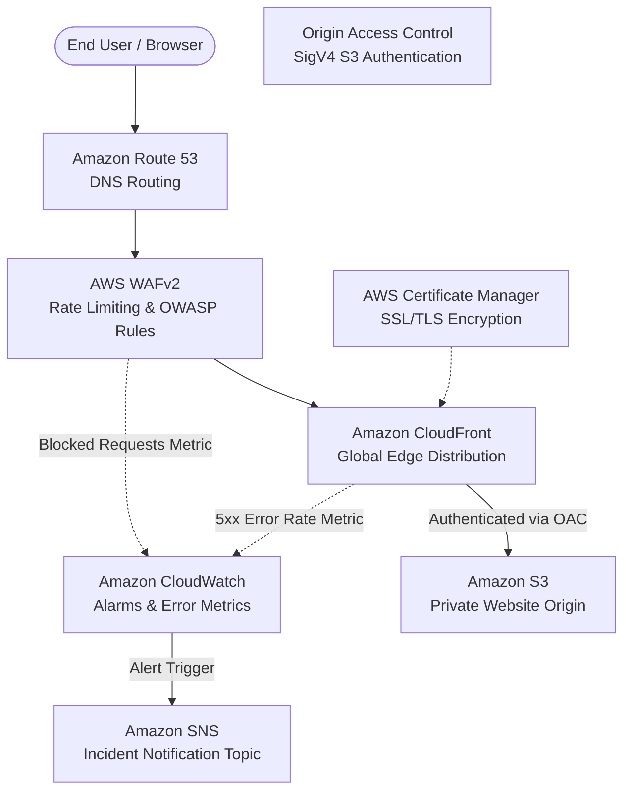

# AWS Production Static Website & Global CDN

An enterprise-grade, highly available, secure static website hosting architecture on Amazon Web Services automated with **Terraform (IaC)** and **GitHub Actions (CI/CD)**.

Serves as the production deployment infrastructure for my personal engineering portfolio.

---

## 🏛️ Architecture Overview



---

## 🛡️ Enterprise Engineering Features

| Category | Implementation | Engineering Benefit |
|---|---|---|
| **Edge Distribution** | **Amazon CloudFront** (`PriceClass_100`) | Low latency, global CDN caching, and lower egress costs. |
| **Origin Security** | **Origin Access Control (OAC)** | The S3 bucket blocks 100% of public access; only CloudFront can read files via SigV4. |
| **Perimeter Defense** | **AWS WAFv2** (`CLOUDFRONT` scope) | Rate limiting (max 500 req / 5 min per IP) and AWS Managed Common Rule Set (OWASP Top 10). |
| **HTTP Hardening** | **Security Headers Policy** | Enforces `Strict-Transport-Security` (HSTS), `X-Frame-Options: DENY`, and `X-Content-Type-Options: nosniff`. |
| **SPA Error Handling** | **CloudFront Custom Errors** | Sub-paths and direct browser reloads automatically route `403/404` to `/index.html` with HTTP 200. |
| **Cost Protection** | **S3 Lifecycle Rules** | Automatically purges noncurrent object versions after 30 days to prevent infinite storage fees. |
| **Observability** | **CloudWatch & SNS** | Real-time alarms for CloudFront 5xx errors (> 5%) and WAF blocked spikes (> 100). |
| **Zero-Lockout Domain** | **Conditional DNS/ACM** | Seamlessly runs on free `*.cloudfront.net` domain or flips to a custom domain with Route 53 & ACM. |
| **Zero-Secret CI/CD** | **GitHub Actions OIDC** | Supports passwordless OpenID Connect role assumption, avoiding static long-lived IAM keys. |

---

## 📁 Repository Structure

```text
aws-static-website/
├── .github/
│   └── workflows/
│       ├── ci.yml                  # Continuous Integration (build test, artifact upload, terraform validate & security scan)
│       └── cd.yml                  # Continuous Deployment (dry-run simulation & controlled AWS deployment)
│
├── frontend/                       # Application Layer (React 18 + Vite 5)
│   ├── src/                        # Modular components, sections, and data files
│   ├── public/                     # Resume, favicons, and static assets
│   ├── package.json
│   ├── vite.config.js
│   └── (dist/ is gitignored)
│
├── infrastructure/                 # Infrastructure as Code (Terraform)
│   ├── versions.tf                 # Terraform & AWS provider constraints
│   ├── providers.tf                # Regional provider + us-east-1 alias for ACM/WAF
│   ├── variables.tf                # Configurable inputs & feature flags
│   ├── terraform.tfvars.example    # Example configuration template
│   ├── main.tf                     # Local shared tags & context
│   ├── s3.tf                       # S3 bucket, OAC policy, lifecycle, encryption & CORS
│   ├── s3-policy.tf                # IAM policy granting read access exclusively to CloudFront
│   ├── cloudfront.tf               # CloudFront distribution, cache policies & error pages
│   ├── waf.tf                      # AWS WAFv2 rate limiting & common rule group
│   ├── acm.tf                      # Conditional SSL/TLS certificate & DNS validation
│   ├── route53.tf                  # Conditional DNS hosted zone & A/AAAA alias records
│   ├── cloudwatch.tf               # Metric alarms & SNS alert topic
│   └── outputs.tf                  # Distribution ID, S3 bucket name, and live site URLs
│
├── Makefile                        # Developer CLI for builds, plans, and deployments
├── .gitignore                      # Standard ignores for dist/ and *.tfstate*
└── README.md
```

---

## ⚡ Quick Start with `make`

A developer `Makefile` is included for single-command operations:

```bash
# View all available commands
make help

# 1. Run local CI pipeline (Frontend build + Terraform validation)
make ci

# 2. Simulate deployment in Dry-Run mode (zero AWS cloud changes)
make deploy-dryrun

# 3. Frontend development
make install
make dev
make build

# 4. Infrastructure management (when ready)
make tf-init
make tf-validate
make tf-plan
make tf-apply
```

---

## 🚀 CI/CD Pipeline Architecture

This repository uses **GitHub Actions** with two distinct workflows:

### 1. Continuous Integration (`.github/workflows/ci.yml`)
* **Triggers:** Automatically on every `push` and `pull_request` to `main` and `develop`.
* **Zero Credentials Needed:** Runs without requiring any AWS account keys.
* **Frontend CI:**
  * Runs `npm ci` and `npm run build` using Node.js 18.
  * Verifies static production bundle integrity (`dist/index.html`, `dist/assets`).
  * Uploads compiled production assets as a downloadable artifact in GitHub Actions (retained for 7 days).
* **Infrastructure CI:**
  * Formats and validates Terraform syntax (`terraform fmt -check`, `terraform validate`).
  * Runs an automated static security scan via **Aqua Security Trivy** to catch misconfigurations.

### 2. Continuous Deployment (`.github/workflows/cd.yml`)
* **Triggers:** Manual trigger via GitHub `Actions > Continuous Deployment > Run workflow`.
* **Dry-Run Mode (Default):**
  * When `dry_run: true`, builds the site and prints a full deployment simulation log without touching AWS.
* **Live Deployment Mode:**
  * When `dry_run: false`, connects to AWS (via OIDC or IAM keys), uploads assets with immutable 1-year caching, uploads HTML with `no-cache`, and executes CloudFront cache invalidation.

---

## ⚙️ Future Cloud Deployment Secrets (Optional)

When you choose to enable live AWS deployments in the future, add the following secrets to GitHub (`Settings > Secrets and variables > Actions`):

* `S3_BUCKET_NAME`: Target S3 bucket name (from `make tf-output`).
* `CLOUDFRONT_DISTRIBUTION_ID`: CloudFront ID (from `make tf-output`).
* `AWS_REGION`: Target AWS region (e.g., `ap-southeast-1`).
* **Authentication (Choose One):**
  * **Option A (Recommended - Enterprise OIDC):** `AWS_ROLE_ARN` (IAM role assumed via GitHub OIDC).
  * **Option B (Static Fallback):** `AWS_ACCESS_KEY_ID` & `AWS_SECRET_ACCESS_KEY`.
