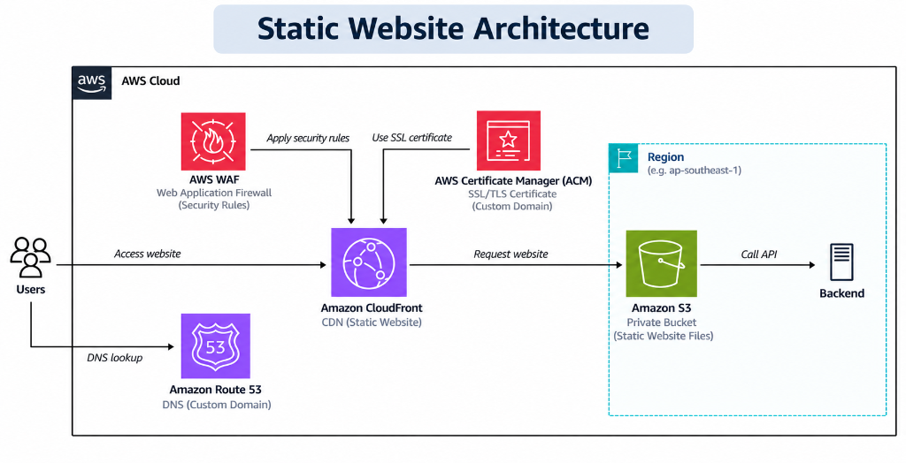

# Enterprise AWS Static Website & Global CDN Architecture

[](https://www.terraform.io/)
[](https://aws.amazon.com/)
[](https://react.dev/)
[](https://github.com/features/actions)
[](https://aws.amazon.com/waf/)
[](LICENSE)

An enterprise-grade, highly available, secure static website hosting architecture built on Amazon Web Services. Fully automated using **HashiCorp Terraform (Infrastructure as Code)** and **GitHub Actions (CI/CD)** with zero live downtime and strict perimeter defense.

Serves as the production deployment infrastructure for my personal engineering portfolio.

---

## 🏛️ Static Website Architecture

<p align="center">
  
</p>

### End-to-End Traffic & Security Flow
1. **DNS Lookup**: End users request the website domain via **Amazon Route 53** (latency-optimized DNS routing with A/AAAA Alias records).
2. **Perimeter Inspection**: Web traffic reaches **AWS WAFv2** attached directly to CloudFront, evaluating incoming requests against IP rate limits (DDoS defense) and AWS Managed Common Rules (OWASP Top 10 mitigation).
3. **Edge SSL/TLS Termination**: **Amazon CloudFront** terminates HTTPS using certificates managed by **AWS Certificate Manager (ACM)** in `us-east-1`.
4. **Origin Access Control (OAC)**: CloudFront signs requests to the **Amazon S3** origin using AWS **SigV4**, authenticating every read request. Direct public internet access to the S3 bucket is 100% blocked.
5. **Client-Side SPA Routing**: CloudFront custom error responses intercept `403` and `404` status codes and seamlessly rewrite them to `/index.html` with an HTTP `200 OK`, supporting seamless React client-side routing.
6. **Telemetry & Alerting**: CloudFront 5xx error metrics and WAF blocked request metrics stream into **Amazon CloudWatch**, triggering **Amazon SNS** alerts when anomaly thresholds are breached.

---

## 🌟 Key Architectural & Engineering Highlights

### 1. Zero-Trust Storage via Origin Access Control (OAC)
* **The Problem**: Traditional static sites often use public S3 buckets or legacy Origin Access Identities (OAI), exposing origins to scraping, unauthorized uploads, and configuration drift.
* **The Solution**: S3 public access is completely blocked (`BlockPublicAcls`, `IgnorePublicAcls`, `BlockPublicPolicy`, `RestrictPublicBuckets`). Only CloudFront can read files, authenticated cryptographically using AWS SigV4 via `aws_cloudfront_origin_access_control`.

### 2. Edge Defense with AWS WAFv2
* **Rate Limiting Engine**: Automatically throttles any client exceeding **500 requests per 5-minute window**, shielding the origin from automated web crawlers and layer-7 denial-of-service attacks.
* **OWASP Top 10 Protection**: Incorporates `AWSManagedRulesCommonRuleSet` to inspect for cross-site scripting (XSS), SQL injection, and path traversal vulnerabilities at edge locations before traffic touches the origin.

### 3. Intelligent Tiered Caching Strategy
* **Hashed Assets (`/assets/*`)**: Configured with `Cache-Control: public, max-age=31536000, immutable`. CloudFront and browser caches hold Vite-bundled assets for 1 full year, eliminating redundant data transfer costs.
* **Entry Point (`index.html`)**: Configured with `Cache-Control: no-cache, no-store, must-revalidate`. Guarantees that users instantly receive the latest release without waiting for browser TTLs or hard-refreshing.

### 4. Zero-Downtime Client-Side (SPA) Routing
* Client-side routing in single-page applications (React) breaks on direct refreshes (e.g., visiting `/projects` returns an S3 `403 Forbidden` or `404 Not Found`).
* CloudFront custom error responses automatically translate `403` and `404` errors into `/index.html` with HTTP `200`, preserving native browser history without requiring server-side rendering (SSR) infrastructure.

### 5. Automated S3 Cost Governance
* S3 versioning protects against accidental file deletion or malicious overwrites.
* S3 Lifecycle Configuration automatically transitions and purges noncurrent object versions after **30 days**, permanently preventing infinite storage cost accumulation.

### 6. Zero-Static-Secret CI/CD (GitHub Actions OIDC)
* Uses OpenID Connect (OIDC) with AWS STS to assume short-lived IAM roles.
* Eliminates the risk of leaking permanent `AWS_ACCESS_KEY_ID` and `AWS_SECRET_ACCESS_KEY` credentials in GitHub Secrets.

### 7. Dual-Domain Flexibility (Zero-Cost Prototyping)
* Configured with a conditional toggle (`enable_custom_domain = false` by default).
* Allows full testing and evaluation using free CloudFront domains (`*.cloudfront.net`) without incurring recurring Route 53 hosted zone fees ($0.50/month) or stalling on DNS verification.

---

## 🛡️ Enterprise Security & Governance Matrix

| Security Domain | Cloud Component | Implementation Details |
|---|---|---|
| **Identity & Access** | AWS IAM / S3 Bucket Policy | Strict SigV4 policy scoped exclusively to the CloudFront distribution ARN. |
| **Origin Isolation** | Amazon S3 | 4-point Public Access Block; bucket website hosting disabled. |
| **Edge Defense** | AWS WAFv2 | IP rate limiting (500 req/5m) + AWS Managed OWASP Core Rule Set. |
| **Transport Security** | CloudFront & ACM | Enforces HTTPS only (`redirect-to-https`) with TLS v1.2 minimum. |
| **HTTP Hardening** | Security Headers Policy | Injects `Strict-Transport-Security` (HSTS), `X-Frame-Options: DENY`, `X-Content-Type-Options: nosniff`. |
| **Data Encryption** | Amazon S3 (SSE-S3) | AES-256 server-side encryption enabled by default on all stored objects. |
| **Observability** | CloudWatch & SNS | Alarms for 5xx Error Rate (> 5%) and WAF Blocked Request spikes (> 100). |
| **Static Security Scanning** | Aqua Security Trivy | Automated Infrastructure as Code vulnerability and misconfiguration scanning in CI. |

---

## 📁 Repository Structure

```text
aws-static-website/
├── .github/
│   └── workflows/
│       ├── ci.yml                  # Continuous Integration: build verification, artifact upload, Terraform validate & Trivy scan
│       └── cd.yml                  # Continuous Deployment: dry-run simulation & controlled AWS deployment
│
├── docs/
│   └── architecture.png            # Visual architecture diagram
│
├── frontend/                       # Application Layer (React 18 + Vite 5)
│   ├── src/
│   │   ├── components/             # Reusable UI widgets, visual FX, layout components
│   │   ├── data/                   # Decoupled profiles, projects, skills, articles models
│   │   ├── sections/               # Modular homepage sections (Hero, Architecture, Projects, etc.)
│   │   ├── App.jsx                 # Application root
│   │   └── index.jsx
│   ├── public/                     # Static assets (Resume PDF, profile images, favicons)
│   ├── package.json
│   └── vite.config.js
│
├── infrastructure/                 # Infrastructure as Code (Terraform)
│   ├── versions.tf                 # Terraform CLI (>= 1.9.0) and AWS provider constraints
│   ├── providers.tf                # Primary regional provider + us-east-1 alias for ACM/WAF
│   ├── variables.tf                # Configurable inputs & feature flags (enable_custom_domain)
│   ├── terraform.tfvars.example    # Configuration template
│   ├── main.tf                     # Shared resource tags and local context
│   ├── s3.tf                       # Private S3 origin, OAC policy, lifecycle rule, AES-256 encryption
│   ├── s3-policy.tf                # Scoped IAM policy granting read access exclusively to CloudFront
│   ├── cloudfront.tf               # CloudFront CDN, managed cache policies, security headers & custom errors
│   ├── waf.tf                      # AWS WAFv2 rate limiting & AWS Managed Ruleset
│   ├── acm.tf                      # Conditional SSL/TLS certificate & DNS validation
│   ├── route53.tf                  # Conditional DNS hosted zone & A/AAAA alias records
│   ├── cloudwatch.tf               # Metric alarms (5xx errors, WAF blocks) & SNS incident topic
│   └── outputs.tf                  # Exported S3 bucket, CloudFront distribution ID, and URLs
│
├── Makefile                        # Single-command developer CLI for CI, dry-runs, and management
├── .gitignore                      # Safe excludes for build dist/, .terraform/, and *.tfstate*
└── README.md
```

---

## ⚡ Developer CLI (`make`)

A comprehensive `Makefile` standardizes operations between local development and CI/CD:

```bash
# Display help and available commands
make help

# ── Continuous Integration (Local) ──────────────────────────────
make ci             # Run full CI test suite (Frontend build + Terraform validation)
make ci-frontend    # Clean install, compile Vite bundle, and verify dist/ integrity
make ci-infra       # Verify Terraform canonical format and validate syntax

# ── Deployment Simulation (Safe) ────────────────────────────────
make deploy-dryrun  # Compile production bundle and simulate deployment cache rules

# ── Frontend Development ────────────────────────────────────────
make install        # Install frontend dependencies (npm install)
make dev            # Start Vite local development server
make build          # Compile production static bundle into frontend/dist

# ── Cloud Infrastructure Management (When ready) ────────────────
make tf-init        # Initialize Terraform providers and backend
make tf-validate    # Format and validate Terraform configuration
make tf-plan        # Preview changes against cloud environment
make tf-apply       # Provision/update AWS infrastructure
make tf-output      # Display CloudFront URL, Distribution ID, and S3 Bucket
```

---

## 🚀 CI/CD Pipeline Architecture

### 1. Continuous Integration (`.github/workflows/ci.yml`)
* **Trigger**: Every `push` and `pull_request` targeting `main` or `develop`.
* **Zero AWS Credentials Required**: Operates completely autonomously.
* **Frontend CI**:
  * Clean installation via `npm ci`.
  * Compiles production static assets via `npm run build`.
  * Verifies build integrity (`dist/index.html` and `dist/assets/`).
  * Uploads compiled bundle as a GitHub Actions artifact (retained for 7 days).
* **Infrastructure CI**:
  * Enforces canonical formatting (`terraform fmt -check -diff`).
  * Initializes provider schema offline (`terraform init -backend=false`).
  * Validates configuration syntax (`terraform validate`).
  * Runs **Aqua Security Trivy** to identify cloud misconfigurations.

### 2. Continuous Deployment (`.github/workflows/cd.yml`)
* **Trigger**: Manual dispatch (`workflow_dispatch`).
* **Dry-Run Mode (Default: `true`)**:
  * Verifies build artifacts and outputs a deployment simulation log showing target cache policies without connecting to AWS.
* **Live Deployment Mode (`dry_run: false`)**:
  * Connects securely via AWS OIDC (or IAM keys).
  * Syncs `/assets` with 1-year immutable caching.
  * Syncs root `/index.html` with `no-cache` revalidation headers.
  * Triggers CloudFront cache invalidation (`/*`).

---

## ⚙️ Future Production Deployment Configuration

When ready to provision live cloud infrastructure and deploy:

1. **Configure Terraform Variables**:
   ```bash
   cp infrastructure/terraform.tfvars.example infrastructure/terraform.tfvars
   ```
   Set your desired S3 bucket name and AWS region:
   ```hcl
   aws_region           = "ap-southeast-1"
   bucket_name          = "dineth-portfolio-website-2026"
   enable_custom_domain = false
   ```

2. **Provision Infrastructure**:
   ```bash
   make tf-init
   make tf-plan
   make tf-apply
   ```

3. **Configure GitHub Repository Secrets** (`Settings > Secrets and variables > Actions`):
   * `S3_BUCKET_NAME`: Target S3 bucket name.
   * `CLOUDFRONT_DISTRIBUTION_ID`: CloudFront distribution ID.
   * `AWS_REGION`: Deployment AWS region.
   * `AWS_ROLE_ARN`: AWS IAM Role ARN for OIDC authentication (or static access keys).

---

## 📄 License
This project is licensed under the [MIT License](LICENSE).
